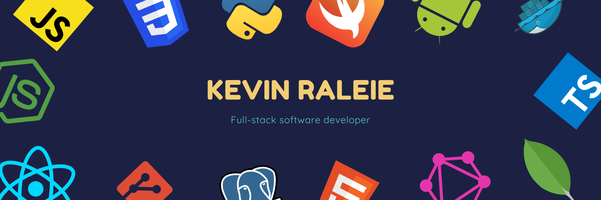

# Hi 👋🏼

### A Bit About Me 😬

I am a software developer, self taught web developer with +3 years of experience and a good eye for design. Being self taught in most things and not following a traditional route in tech has given me great empathy for people of all ability level and backgrounds. Outside of work, I build open source projects, contribute to open source, mentor junior devs and I enjoy helping others get started in the world of engineering and building products for themselves and others, a cause I feel extremely passionate about.

Other things that also interest me are K-drama series, currently watching StrongGirl Bong-Soon and my favorite so far has to be Vincenzo ❤️. I'm also great in the kitchen, cooking has been a new found passion for me and i'm enjoying it so far.

### Working on, Learning and Collab 👇🏼  
- 🔭 I’m currently working on ... [Building a peer-to-peer, fashion marketplace](https://github.com/KevinRaleie-dev/threads-ui) and a few other projects.
- 🌱 I’m currently learning ... Elixir. 
- 👯 I’m looking to collaborate on ... Anything awesome!.
- 😄 Pronouns: ... He/Him

### My Tech Stack ⚡️

🔥 React / Next.js / React native
🔥 GraphQL
🔥 Node.js
🔥 Typescript / Javascript
🔥 PostgreSQL (you can never go wrong with a SQL database)
🔥 AWS / Netlify / Netlify Functions
